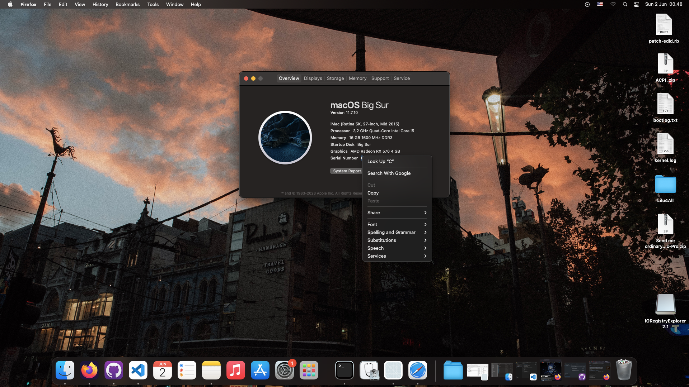

# Hackintosh OpenCore V1.0.0

- Processor : i5-3470 4C/4T (IvyBridge)
- Motherboard : Kaizen B75 (Chinese brand)
- RAM : 16GB DDR3 1600mhz
- GPU : AMD RX570 4GB
- Storage : Kaizen 256GB NVME
- PSU : Aerocool 550w 80+ gold
- Ethernet : Realtek RTL8139/810x Family Fast Ethernet NIC

MacOS version : Big Sur 11.7.10

Whats Working?
- Ethernet
- GPU Output
- Speaker (Soundcard Used)

# Generate your own serial with GenSMBIOS!

# Notes
Config is the same if you want to install MacOS Monterey. Just change SMBIOS to MacPro6,1.

credits
- Dortania (OpenCore)
- Olarila (Tools provider)
- @Meize (Realtek Ethernet Driver)
- @adaugherity (pink display fix)